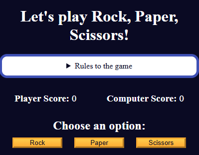

# ✊📄✂️ Rock, Paper, Scissors Game

Un juego clásico de "Piedra, Papel o Tijeras" creado con **HTML, CSS y JavaScript**. Juega contra la computadora y sé el primero en llegar a 3 puntos.

## 🎮 Características

- Jugabilidad interactiva contra la computadora.
- Interfaz responsiva y accesible.
- Reglas claras y visibles desde la propia interfaz.
- Puntuación dinámica en tiempo real.
- Reinicio del juego con un solo clic.

## 🧠 Lógica del Juego

- Piedra vence a Tijeras  
- Tijeras vencen a Papel  
- Papel vence a Piedra  
- En caso de empate (misma elección), no se otorgan puntos.

## 📁 Estructura del Proyecto

```
rock-paper-scissors/
│
├── index.html        # Estructura principal del juego
├── styles.css        # Estilos del juego (colores, diseño, botones)
├── script.js         # Lógica y comportamiento del juego
├── img/              # Contiene los recursos de imágenes
│   └── screenshot.png # Captura de pantalla del juego
└── README.md           
```

## 🚀 Cómo usar

1. Clona este repositorio o descarga los archivos.
2. Abre `index.html` en tu navegador.
3. ¡Elige Piedra, Papel o Tijeras y juega contra la computadora!

## 🛠️ Tecnologías usadas

- HTML5
- CSS3 (con variables y media queries)
- JavaScript (DOM, lógica condicional, eventos)

## 📸 Vista previa


